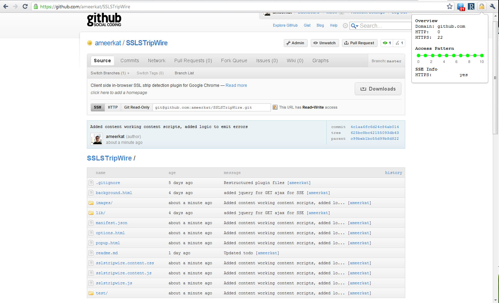

#SSLSTripWire
SSL Strip Wire is an attempt to create a browser extension to help augment
the fact that we are human when it comes to noticing encryption security
on websites. The objective is to create a plugin that will recognize when
something out of the ordinary is occuring with regards to encryption on
websites you have visited in the past in an attempt to prevent SSL Strip 
attacks.

<b>Under development (11/16/2010)</b>

## Screenshots

## TODO
* Request rewriting
* Improved heuristics
* ?Detailed domain overview page
* Success <i>and</i> error callback parameters to all functions
* Classifier for access patterns
* Add some documentation
